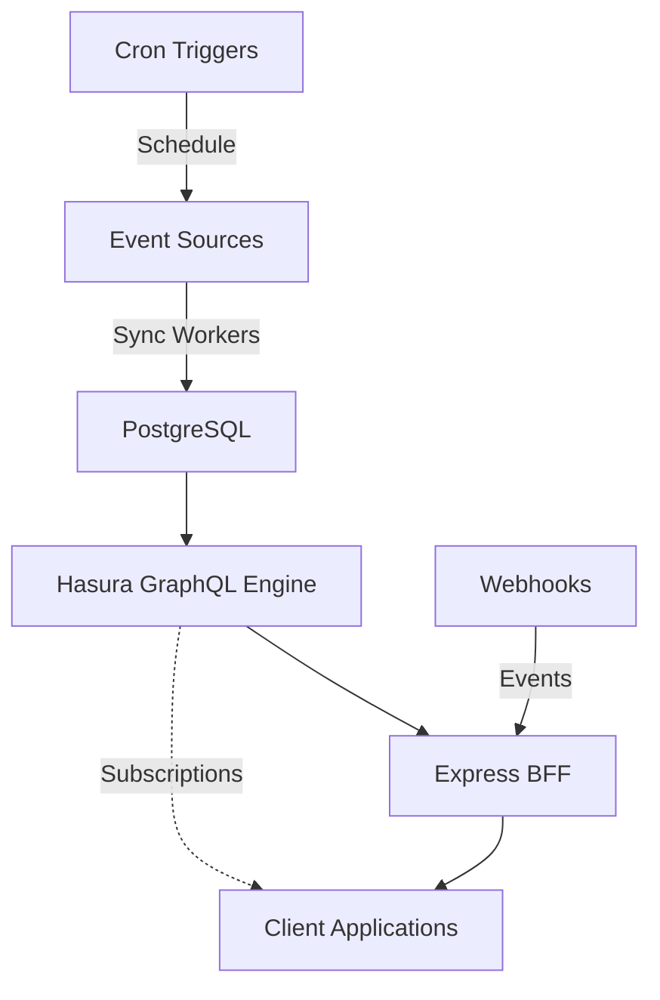

# GraphQL-Powered Prediction Market Calendar

This is an enhanced version of the Prediction Market Calendar using GraphQL patterns learned from the FortyTwo Protocol Admin Dashboard.

## 🚀 Key Improvements

### 1. **Database-First Architecture**
- Comprehensive PostgreSQL schema with proper normalization
- Categories, subcategories, and topics for rich taxonomy
- Event metadata and outcome tracking
- Price history for charting capabilities
- Full-text search with PostgreSQL

### 2. **GraphQL API with Hasura**
- Automatic GraphQL API generation from database schema
- Real-time subscriptions for live updates
- Role-based access control (anonymous, user, admin)
- Optimized queries with relationship loading
- Aggregations and computed fields

### 3. **Backend for Frontend (BFF) Pattern**
- Express server as GraphQL proxy
- JWT generation for Hasura authentication
- Webhook handlers for event processing
- Custom actions for complex operations

### 4. **Automated Syncing**
- Source-agnostic design (easy to add Manifold, Metaculus, etc.)
- Incremental updates with change detection
- Cron triggers for scheduled syncs
- Comprehensive audit logging

### 5. **Real-Time Features**
- Live probability updates via subscriptions
- Event notifications on significant changes
- Automatic UI updates without page refresh

## 📁 Project Structure

```
graphql/
├── schema.sql                 # Database schema
├── hasura-metadata.yaml      # Hasura configuration
├── server.ts                 # Express BFF server
├── docker-compose.yml        # Local development setup
├── sync/
│   ├── polymarket.ts        # Polymarket sync adapter
│   ├── manifold.ts          # (future) Manifold adapter
│   └── metaculus.ts         # (future) Metaculus adapter
├── components/
│   ├── EventCalendar.tsx    # React calendar component
│   ├── EventList.tsx        # List view component
│   └── EventDetails.tsx     # Detail view component
├── queries/
│   └── example-queries.graphql # Example GraphQL queries
└── scripts/
    ├── migrate-data.js      # Data migration script
    └── seed-categories.ts   # Category seeding script
```

## 🛠️ Setup

### Prerequisites
- Docker & Docker Compose
- Node.js 18+
- PostgreSQL client (optional, for debugging)

### Quick Start

1. **Clone and setup:**
   ```bash
   cd prediction-market-calendar/graphql
   cp .env.example .env
   npm install
   ```

2. **Start services:**
   ```bash
   docker-compose up -d
   ```

3. **Initialize database:**
   ```bash
   # Metadata will be applied automatically
   # Seed initial categories
   npm run seed
   ```

4. **Run initial sync:**
   ```bash
   npm run sync
   ```

5. **Access services:**
   - GraphQL API: http://localhost:4000/api/graphql
   - Hasura Console: http://localhost:8080
   - Calendar UI: http://localhost:3000

## 📊 Example Queries

### Get upcoming events with full details:
```graphql
query GetUpcomingEvents {
  event(
    where: { 
      status: { _eq: "active" }
      end_date: { _gt: "now()" }
    }
    order_by: { end_date: asc }
    limit: 20
  ) {
    id
    title
    probability
    volume
    end_date
    
    categories {
      category {
        name
        color
        icon
      }
    }
    
    outcomes {
      name
      probability
    }
  }
}
```

### Subscribe to live updates:
```graphql
subscription WatchEventUpdates($eventId: uuid!) {
  event_by_pk(id: $eventId) {
    probability
    volume
    updated_at
  }
}
```

### Get events by category:
```graphql
query GetPoliticsEvents {
  category(where: { slug: { _eq: "politics" } }) {
    name
    event_categories(
      where: { event: { status: { _eq: "active" } } }
    ) {
      event {
        title
        probability
        end_date
      }
    }
  }
}
```

## 🔄 Data Flow



## 🎯 Features Comparison

| Feature | Old (REST) | New (GraphQL) |
|---------|------------|---------------|
| Real-time updates | ❌ | ✅ Subscriptions |
| Search | Basic | ✅ Full-text + filters |
| Categories | ❌ | ✅ Hierarchical taxonomy |
| Price history | ❌ | ✅ Time-series data |
| Multi-source | Limited | ✅ Extensible design |
| Caching | File-based | ✅ Query-level |
| API flexibility | Fixed endpoints | ✅ Query what you need |
| Offline support | ❌ | ✅ Apollo cache |

## 🔐 Security

- JWT-based authentication
- Role-based access control
- Webhook secret validation
- Environment variable configuration
- SQL injection protection via Hasura

## 🚀 Deployment

### Railway
```bash
railway up --service graphql-calendar
```

### Heroku
```bash
heroku create prediction-calendar-graphql
heroku addons:create heroku-postgresql:hobby-dev
heroku config:set HASURA_GRAPHQL_ENDPOINT=https://your-hasura.herokuapp.com
git push heroku main
```

## 🔧 Configuration

Environment variables:
- `DATABASE_URL` - PostgreSQL connection string
- `HASURA_GRAPHQL_ENDPOINT` - Hasura GraphQL endpoint
- `HASURA_ADMIN_SECRET` - Admin secret for Hasura
- `JWT_SECRET` - Secret for JWT signing (32+ chars)
- `PORT` - Server port (default: 4000)

## 📚 Resources

- [Hasura Documentation](https://hasura.io/docs/)
- [GraphQL Best Practices](https://graphql.org/learn/best-practices/)
- [Apollo Client Docs](https://www.apollographql.com/docs/react/)
- [Migration Guide](../MIGRATION-TO-GRAPHQL.md)

## 🤝 Contributing

1. Fork the repository
2. Create a feature branch
3. Add your sync adapter or component
4. Submit a pull request

## 📄 License

MIT